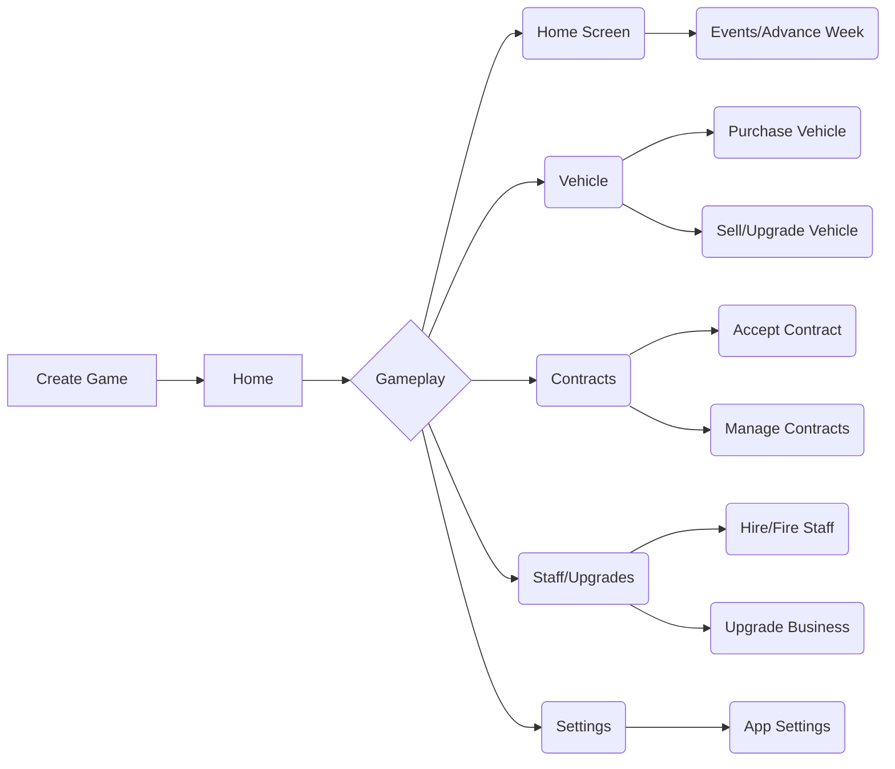

# Jetpack Compose Text-Based Game

An Android game created entirely with Jetpack Compose.

The game takes inspiration from other text-based mobile games and puts the player in the role of operating and managing a business.
This README has been written in a way to add clarity in the more generic case rather than specifically for this repository. (And also so I can understand the code I wrote months ago)   

## Architecture

This project was created to work on skills in Android, Compose, Room, Clean Architecture, MVVM, and Dagger Hilt. The structure of the game itself is more just an exercise in good practice Android development and being a simulation game, the code is more similar to that of a standard business application than a game.  

### Feature Structure

Each aspect of the game is broken down into a feature and has a file structure like the one shown here:

📦feature_example\
 ┣ 📂data\
 ┃ ┣ 📂data_source\
 ┃ ┗ 📂repository\
 ┣ 📂di\
 ┣ 📂domain\
 ┃ ┣ 📂model\
 ┃ ┣ 📂repository\
 ┃ ┗ 📂use_case\
 ┗ 📂presentation\
 ┃ ┣ 📂components\
 ┃ ┣ 📂screens\
 ┃ ┣ 📂view_models\

### Data Storage

Data is stored utilizing RoomDB and currently is the single holder of data. As a result, the repository is not really needed but I wanted to keep it in to add flexibility of adding other data sources later. 

Everything stored in the DB is linked to the individual game by the game's ID. For ease of access, a global game object contains a Flow<Game> that is set when a user loads a game.

UserSettings has not yet been implemented, but the plan is to add a SharedPreferences/DataStore interaction class that will handle storing those. 

### Current Status

The following features are "complete" as of now, however once a full MVP is finished I plan to go back and add assets, improve the UI, and play with values to make the game fun
* Vehicles
* Contracts
* Staff and Upgrades

